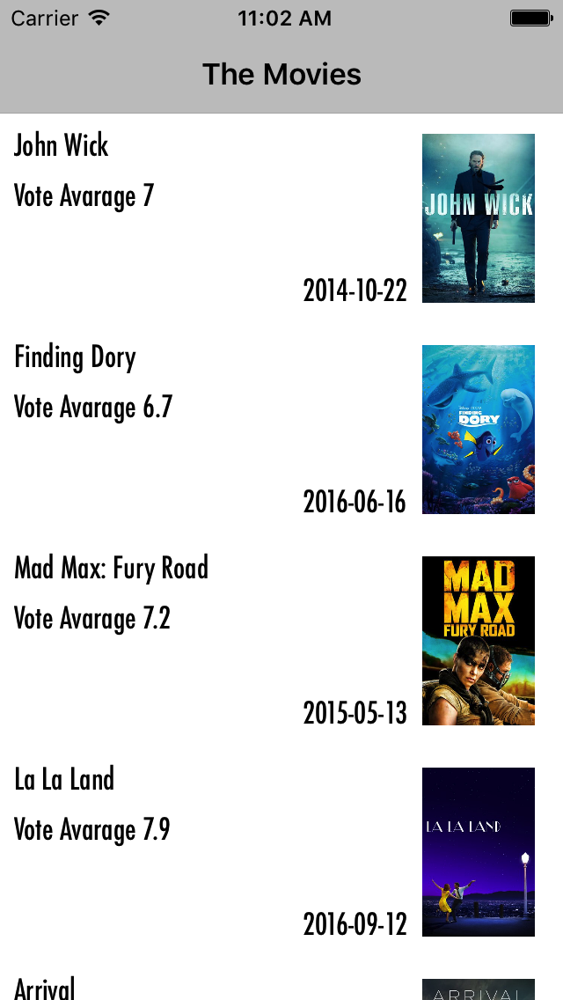
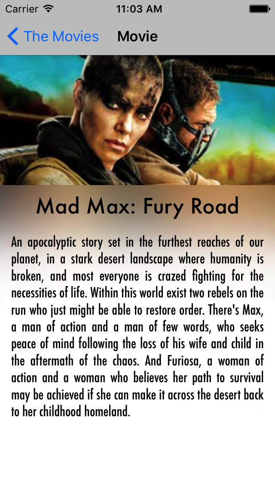

# The Movies

Simple app that provides a list of movies from [The Movie DB](https://www.themoviedb.org) API and a short
details with cover image and background. Also this project follow the  MVVM architecture. This project serves as a practical example of building an iOS application using Swift and the MVVM pattern, consuming a third-party API.

If you want to know more about this API follow  [The Movie API](https://www.themoviedb.org/documentation/api)

## API Key Configuration
This application uses The Movie Database (TMDb) API to fetch movie information. To run the app, you must obtain an API key from TMDb.
1.  Visit [The Movie Database website](https://www.themoviedb.org/settings/api) and create an account (or sign in).
2.  Request an API key (v3 auth).
3.  Once you have your API key, open the `DCTheMovie/DCTheMovie/Constants.swift` file in the project.
4.  Replace the placeholder string `"PleaseEnterYourAPIKeyHere"` for the `apiKey` static variable with your actual API key.
```swift
// Example in Constants.swift:
struct K {
    struct TheMovieServer {
        // ... other constants
        static let apiKey = "YOUR_ACTUAL_API_KEY_HERE" // Replace this
    }
    // ...
}
```

## Prerequisites
*   "Xcode (latest stable version recommended, e.g., Xcode 14 or newer)"
*   "Swift (e.g., Swift 5.7 or newer, typically bundled with Xcode)"
*   "macOS (latest stable version recommended)"
*   "[CocoaPods](https://cocoapods.org)"

## Features

- Browse a list of popular and searchable movies.
- Search movies
- Movie details (name, image, runtime, budget, release date, revenue, overview).
- Add movie to Must Watch list
- Add movie to Watched list
- In App Purchase (Placeholder/Planned Feature - Not yet implemented)
- About screen providing information about the project.

## Screenshots


*Main movie listing*


*Movie details view*

## Technical Highlights

- UI improvements using `UIDynamics` to animate the movie cover image.
- Minor adjustments in UI for an improved user experience.
- Enhanced API interaction layer: Implemented a dedicated router layer for managing API URLs, inspired by [Alaeddine's Medium article](https://medium.com/@AladinWay/write-a-networking-layer-in-swift-4-using-alamofire-and-codable-part-1-api-router-349699a47569).
- Data Access Layer: Refinements made to the data access layer and its management.
- Modern Data Parsing: Leveraged Swift's `Codable` protocol for robust JSON parsing in data models.

## Installation and Build

To build the project, you first need to install [CocoaPods](https://cocoapods.org). Then, navigate to the project's root directory in your terminal and run `pod install` to install the required dependencies.
If you have already installed the pods and want to update them to newer versions as specified in the `Podfile.lock` or `Podfile`, you can run `pod update`.
```
pod update
```

## Usage
After successfully building the project and installing the dependencies:
1. Open the `.xcworkspace` file in Xcode (i.e., `DCTheMovie/DCTheMovie.xcworkspace`).
2. Select a simulator or a connected device.
3. Run the app from Xcode.

## Pods used in this app

```
pod 'Alamofire', '~> 4.4'
pod 'AlamofireImage'
pod 'OHHTTPStubs/Swift', '~> 6.0.0'
```

## Code coverage

Over 84% code coverage, including UI tests.

## Layout

I also uploaded in this repository a [Sketch](https://www.sketchapp.com) file with the initial idea about the app layout.

## License
This project is offered as-is. Please feel free to fork, modify, and use it as a learning resource. If you plan to release a derivative, consider adding an open-source license (e.g., MIT License).

## Contributors

[Phelippe](https://github.com/phyll88) for their amazing knowledge of size classes and constraints.


